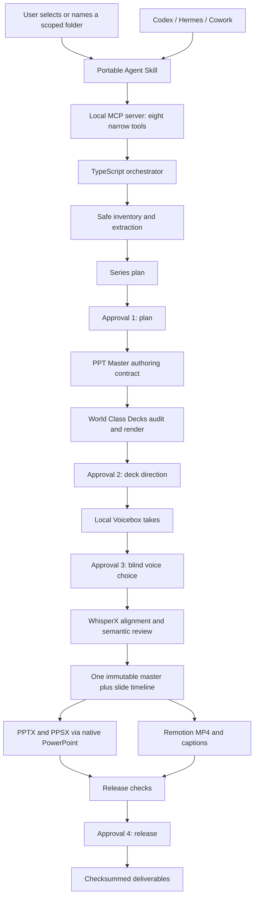

# Architecture and data flow

## Ownership boundaries

| Component | Owns | Must not own |
|---|---|---|
| Host skill | Conversation, questions, explanations in Codex, Hermes or Cowork | Approval or arbitrary commands |
| MCP server | Narrow local capabilities and redacted status | Shell passthrough, unrestricted paths, profile IDs |
| Orchestrator | State, receipts, invalidation, resumability, assembly | Creative or consent claims |
| World Class Decks | Briefs, capability checks, audit, render, contact sheet, visual QA | Native authoring engine |
| PPT Master | Editable native deck authoring | Project state or approvals |
| Narration pipeline | Consent, takes, master checksum, alignment, continuity, disclosure | Silent audio repair |
| Remotion | Cross-platform MP4 composition and Player component | Native PPTX playback claims |
| PowerPoint | Native PPTX/PPSX playback evidence | Cross-platform preview composition |

## Persistent model

Each source folder has a private `.narrated-deck-studio` workspace unless an external workspace is supplied. Git-managed source folders require an explicit external workspace. `project.json`, `inventory.json`, `plan.json`, review subjects and reports are atomic JSON files. `approval-receipts.ndjson` and `revisions.ndjson` are append-only.

Planning defaults to one `SeriesItem` per discovered PowerPoint. Each item keeps its own source-deck mapping, script, approved continuous master, timeline and deliverable directory. An explicit custom plan may combine or split sources, but it cannot silently drop a discovered deck.

Approvals bind to exact SHA-256 hashes. A plan, deck, script, master or timeline revision invalidates that gate and all dependent gates. Production stages only run from their exact preceding approved state.

## Trust boundaries

Source content is data, never instructions. The scanner ignores hidden/system/dependency/output directories, blocks executable attachments, flags macros, never follows symlinks, and verifies canonical paths remain inside the selected root. The review server uses a random URL token, CSP, no-store responses, loopback binding and confined media access.

Private voice material, consent evidence and generated takes live under mode-hardened project paths. Voicebox must be loopback-only. Profile IDs are read from process environment and never returned by MCP or persisted in the project.
